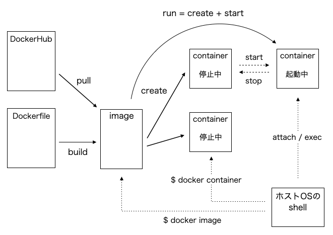
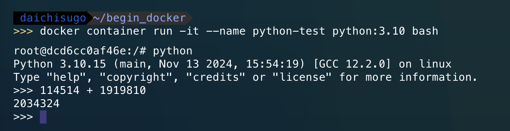
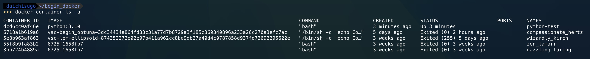

# Contents
- [Dockerとは](#dockerとは)
    - [コンテナとは](#コンテナとは)
- [Dockerの基本的な使用手順](#dockerの基本的な使用手順)
    - [コンテナを作成](#コンテナを作成)
    - [コンテナを停止](#コンテナを停止)
    - [コンテナを削除](#コンテナを削除)
        - [コンテナは毎回削除する](#コンテナは毎回削除する)
    - [コンテナ内のデータの永続化](#コンテナ内のデータの永続化)
        - [方法1: ボリューム](#方法1-ボリューム)
        - [方法2: バインドマウント](#方法2-バインドマウント)
- [Dockerfileでイメージを作ってみる](#Dockerfileでイメージを作ってみる)
    - [Dockerfileに記述できる主な命令](#Dockerfileに記述できる主な命令)
-  [Docker Composeでコンテナを作ってみる](#docker-composeでコンテナを作ってみる)
    - [Docker Compsoseファイルを作成する](#docker-composeファイルを作成する)
- VSCode+Dockerで開発環境を構築
    - 拡張機能のインストール
    - VSCodeで実行するプログラム環境をコンテナにする
    - hoge
- [dockerコマンド表](#dockerコマンド表)

</br>

# Dockerとは
Dockerとは，[コンテナ](#コンテナとは)を作成・実行するためのソフトウェア．（は？）

## コンテナとは
コンテナとは，**「アプリ&ファイルシステムを隔離する特殊なプロセス」** のこと．
（**プロセス**とは，OS上で動作している１つ１つの処理（動作中の個々のプログラム）のこと．）

要するに，コンテナ技術を使うことで，**そのプロセスの中だけが別マシンで動いているような状態になる** ．

# Dockerの基本的な使用手順
 Dockerの基本的な使用手順は以下の通り．
[Docker Desktop](https://www.docker.com/ja-jp/products/docker-desktop/)が起動していないと`docker`コマンドが認識されないため注意．

1. imageを作成（Dockerfileを使ってbuild，またはDockerHubからpull）
2. imageからcontainerを作成
3. containerを起動
4. containerを停止・削除

- Docker基本コマンド  
    

## コンテナを作成
ここでは，Pythonをインストールしたコンテナを作成し，対話型で起動してみる．
- pythonコンテナをbashで起動
    ```docker
    docker container run -it --name python-test python:3.10 bash
    ```
    | 項目 | 意味 |
    | --- | --- |
    | `docker container run` | コンテナを作成＆起動|
    | `-it` | インタラクティブモードでコンテナを起動 |
    | `--name` | コンテナに名前をつける |
    | `python-test` | コンテナの名前 |
    | `python:3.10` | ベースとなるイメージ．`:`以降はバージョンの指定であり，最新のものを使う場合は`:latest`と入力 |
    | `bash` | 使用するシェル |
`docker container run`コマンドでは，指定したイメージがダウンロードされていない場合は，自動でDockerHubからイメージをpullしてから，コンテナを作成・実行する．
つまり，上記コマンドでは，[Dockerの基本的な使用手順](#dockerの基本的な使用手順)における，ステップ1から3までが同時に実行されていることになる．

起動されたシェル（bash）で，pythonを対話型で起動し，素敵な足し算をさせた例を以下に示す．

- pythonを対話型で起動

    

対話型で起動したpythonは`exit()` or `Ctrl+D`，bashは`exit` or `Ctrl+D`で終了できる．

## コンテナを停止
以下のコマンドを入力．`python-test`の部分は停止したいコンテナの名前．
```
docker container stop python-test
```
※ 対話型で起動したシェルを抜けると自動でコンテナは停止する．

- 停止中のコンテナを含むコンテナ一覧は`docker container ls -a`で確認できる
    

    | 項目 | 意味|
    | --- | --- |
    | `CONTAINER ID` | コンテナのID．環境によって値が異なる． |
    | `IMAGE` | コンテナのベースとなっているイメージ |
    | `COMMAND` | 実行されたコマンド |
    | `CREATED` | コンテナを作成した日時 |
    | `STATUS` | コンテナの状態（起動中は`Up`，停止中は`Exited`） |
    | `PORTS` | 紐づいているポート番号 |
    | `NAMES` | コンテナの名前 |


## コンテナを削除
以下のコマンドを入力．`python-test`の部分は削除したいコンテナの名前．
```
docker container rm python-test
```

### コンテナは毎回削除する
コンテナは **「作っては削除」が基本**．なぜならコンテナの作成・削除コストが非常に低いから．
この **「作っては削除」** が簡単に行えるのがコンテナの魅力でもある．
ただし，コンテナを削除するとコンテナ内のデータも削除されるため，必要なデータは，ファイルのバインドマウントなどで，[データを永続化](#コンテナ内のデータの永続化)する必要がある．

#### Note
- イメージやコンテナが増えてくるとストレージを圧迫するため，不要なものはその都度削除する（DockerHubやDockerfileから簡単に再現できるため）
- ローカルでの開発用途の利用であれば停止したコンテナを再利用するケースは一応あるけど...

## コンテナ内のデータの永続化

### 方法1: ボリューム
**ボリューム**は，Dockerが管理する記憶領域にデータを永続化する仕組み．
データを変更する際は，データを直接操作するのではなく，コンテナを通して行う．
そのため，データベースのデータなど，**直接変更することのないデータ**に向いている．

### 方法2: バインドマウント
**バインドマウンド**は，ホストOSのフォルダーやファイルをマウントする仕組み．
データを変更する際は，ホストOSのファイルを直接変更することで，コンテナ内にも自動で反映される．
そのため，**変更頻度の高いデータ**に向いている．


### Note
- dockerコマンドには**古い書き方（例えば`docker container run`ではなく`docker run`，`docker image pull`ではなく`docker pull`など）が存在**
- **Docker ComposeにもV1とV2が存在**
    - コマンドはV1では`docker-compose`，V2では`docker compose`
    - yamlファイルの名前はV1では`docker-compose.yaml`が使われていたが，V2では`compose.yaml`が推奨されている


</br>

# Docker Composeでコンテナを作ってみる
このセクションでは実際にDocker ComposeでApacheコンテナを作成する．
（とりあえず作ってみることが目的なので，詳しいことは理解しなくてもOK．）

- 作成するApacheコンテナの情報
    | コンテナ作成に必要な項目 | 設定値 |
    | ----- | ----- |
    | 使用するイメージ | httpd（バージョンは2.4） |
    | ポート番号 | 8080.80 |

## Docker Composeファイルを作成する
Docker Composeでコンテナを作るには`compose.yaml`が必要．
デフォルトではカレントディレクトリにある`compose.yaml`が読み込まれ，
Docker Composeのプロジェクト名にはカレントディレクトリの名前が使用される．

- ディレクトリの構造
    <pre>
    .
    └── apache
        └── compose.yaml
    </pre>


</br>

# Dockerfileでイメージを作ってみる
Dockerfileとは．．．

## Dockerfileに記述できる主な命令
| 命令 | 意味 |
| --- | --- |
| `FROM`       | 元となるイメージを指定する |
| `RUN`        | イメージのビルド時に実行するコマンド |
| `CMD`        | コンテナの起動時に実行するコマンド |
| `EXPOSE`     | 公開するポート番号．ただし，あくまでどのポートを公開したいかという意図を示すためのものであり，実際に公開するには`docker container run`で`-p`を指定するか，Docker Composeファイルで`ports`を記述する必要がある． |
| `COPY`       | イメージにファイルやフォルダをコピーする |
| `ADD`        | イメージにファイルやフォルダをコピーする．tarの展開などが可能など，COPYより高機能だが，COPYがが推奨されている． |
| `ENTRYPOINT` | コンテナの起動時に実行するコマンド．基本的にコマンドの上書きはできない |
| `WORKDIR`    | 作業ディレクトリを指定する．ディレクトリが存在しない場合，ディレクトリを作成． |


</br>

## dockerコマンド表

dockerコマンドはすべて `docker 対象 操作` の順に入力する．

| 対象 | 操作 | オプション |
| --- | --- | --- |
| `image` | `build` | hgoe |
|         | `ls`    | hgoe |
|         | `pull`  | hgoe |
|         | `push`  | hgoe |
|         | `rm`    | hgoe |
| `container` | `run`   | hgoe |
|             | `start` | hgoe |
|             | `stop`  | hgoe |
|             | `rm`    | hgoe |
| `network` | `create` | hgoe |
|           | `ls`     | hgoe |
|           | `rm`     | hgoe |
| `volume` | `create` | hgoe |
|          | `ls`     | hgoe |
|          | `rm`     | hgoe |
| `compose` | `up`    | hgoe |
|           | `run`   | hgoe |
|           | `start` | hgoe |
|           | `stop`  | hgoe |
|           | `down`  | hgoe |


</br>
