# Contents
- [Dockerとは](#dockerとは)
    - [コンテナとは](#コンテナとは)
- [Dockerの基本的な使用手順](#dockerの基本的な使用手順)
    - [コンテナを作成](#コンテナを作成)
    - [コンテナを停止](#コンテナを停止)
    - [コンテナを削除](#コンテナを削除)
        - [コンテナは毎回削除する](#コンテナは毎回削除する)
- [DockerfileとDocker Composeで自作コンテナを作ってみる](#dockerfileとdocker-composeでコンテナを作ってみる)
    - [1. Dockerfileで作成したいコンテナの情報を整理する](#1-dockerfileで作成したいコンテナの情報を整理する)
        - [Dockerfileに記述できる主な命令](#dockerfileに記述できる主な命令)
    - [2. Docker Composeファイルを作成する](#2-docker-composeファイルを作成する)
        - [servicesの主な項目](#servicesの主な項目)
    - [3. Docker Composeコマンドを使ってコンテナを作成&実行する](#3-docker-composコマンドを使ってコンテナを作成実行する)
        - [起動したJupyter Labにアクセス](#起動したjupyter-labにアクセス)
        - [Docker Composeで作成したコンテナを停止&削除](#docker-composeで作成したコンテナを停止削除)
        - [Dockerfileのみを使う場合](#dockerfileのみを使う場合)
    - [Docker Composeで複数コンテナを一度に作成](#docker-composeで複数コンテナを一度に作成)
    - [コンテナ内のデータの永続化](#コンテナ内のデータの永続化)
        - [方法1: バインドマウント](#方法1-バインドマウント)
        - [方法2: ボリューム](#方法2-ボリューム)
- [Visual Studio Code + Dockerで開発環境を構築](#visual-studio-code--dockerで開発環境を構築)
    - [拡張機能のインストール](#拡張機能のインストール)
    - [VSCodeでコンテナに接続する](#vscodeでコンテナに接続する)

</br>

# Dockerとは
Dockerとは，[コンテナ](#コンテナとは)を作成・実行するためのソフトウェア．（は？）

- [公式ロゴ](https://www.docker.com/ja-jp/company/newsroom/media-resources/)

    

</br>

## コンテナとは
コンテナとは，**「アプリ&ファイルシステムを隔離する特殊なプロセス」** のこと．
（**プロセス**とは，OS上で動作している１つ１つの処理（動作中の個々のプログラム）のこと．）

要するに，コンテナ技術を使うことで，**そのプロセスの中だけが別マシンで動いているような状態になる** ということ．

- [コンテナのイメージ](https://www.sbbit.jp/article/cont1/57184)

    

</br>

# Dockerの基本的な使用手順
 Dockerの基本的な使用手順は以下の通り．
[Docker Desktop](https://www.docker.com/ja-jp/products/docker-desktop/)が起動していないと`docker`コマンドが認識されないため注意．
dockerコマンドはすべて `docker 対象 操作`（例えば`dokcer container run`など） の順に入力する．

1. imageを作成（Dockerfileを使ってbuild，またはDockerHubからpull）
2. imageからcontainerを作成
3. containerを起動
4. containerを停止・削除

- Docker基本コマンド  
    

</br>

## コンテナを作成
ここでは，Pythonをインストールしたコンテナを作成し，対話型で起動してみる．
- pythonコンテナをbashで起動
    ```docker
    docker container run -it --name python-test python:3.10 bash
    ```
    | 項目 | 意味 |
    | --- | --- |
    | `docker container run` | コンテナを作成＆起動|
    | `-it` | インタラクティブモードでコンテナを起動 |
    | `--name` | コンテナに名前をつける |
    | `python-test` | コンテナの名前 |
    | `python:3.10` | ベースとなるイメージ．`:`以降はバージョンの指定であり，最新のものを使う場合は`:latest`と入力 |
    | `bash` | 使用するシェル |
`docker container run`コマンドでは，指定したイメージがダウンロードされていない場合は，自動でDockerHubからイメージをpullしてから，コンテナを作成・実行する．
つまり，上記コマンドでは，[Dockerの基本的な使用手順](#dockerの基本的な使用手順)における，ステップ1から3までが同時に実行されていることになる．

起動されたシェル（bash）で，pythonを対話型で起動し，素敵な足し算をさせた例を以下に示す．

- pythonを対話型で起動

    

対話型で起動したpythonは`exit()` or `Ctrl+D`，bashは`exit` or `Ctrl+D`で終了できる．

</br>

## コンテナを停止
以下のコマンドを入力．`python-test`の部分は停止したいコンテナの名前．
```
docker container stop python-test
```
※ 対話型で起動したシェルを抜けると自動でコンテナは停止する．

- 停止中のコンテナを含むコンテナ一覧は`docker container ls -a`で確認できる
    

    | 項目 | 意味|
    | --- | --- |
    | `CONTAINER ID` | コンテナのID．環境によって値が異なる． |
    | `IMAGE` | コンテナのベースとなっているイメージ |
    | `COMMAND` | 実行されたコマンド |
    | `CREATED` | コンテナを作成した日時 |
    | `STATUS` | コンテナの状態（起動中は`Up`，停止中は`Exited`） |
    | `PORTS` | 紐づいているポート番号 |
    | `NAMES` | コンテナの名前 |

</br>

## コンテナを削除
以下のコマンドを入力．`python-test`の部分は削除したいコンテナの名前．
```
docker container rm python-test
```

### コンテナは毎回削除する
コンテナは **「作っては削除」が基本**．なぜならコンテナの作成・削除コストが非常に低いから．
この **「作っては削除」** が簡単に行えるのがコンテナの魅力でもある．
ただし，コンテナを削除するとコンテナ内のデータも削除されるため，必要なデータは，ファイルのバインドマウントなどで，[データを永続化](#コンテナ内のデータの永続化)する必要がある．

#### Note
- dockerコマンドには**古い書き方（例えば`docker container run`ではなく`docker run`，`docker image pull`ではなく`docker pull`など）が存在**
- イメージやコンテナが増えてくるとストレージを圧迫するため，不要なものはその都度削除する（DockerHubやDockerfileから簡単に再現できるため）
- ローカルでの開発用途の利用であれば停止したコンテナを再利用するケースは一応ある...


</br>

# DockerfileとDocker Composeで自作コンテナを作成する
このセクションでは，実際にDockerfileとDocker Composeを使ってカスタムされたコンテナを作成する．
コンテナ作成の手順は以下の通り．

1. [作成したいコンテナの情報を整理する](#1-作成したコンテナの情報を整理する)
2. [Docker Composeファイルを作成する](#2-docker-composeファイルを作成する)
3. [コマンドを使ってコンテナを作成・実行する](#3-コマンドを使ってコンテナを作成実行する)

</br>

## 1. Dockerfileで作成したいコンテナの情報を整理する
まずはじめに，作成したいコンテナに必要なソフトウェアを整理する．
ここでは，PythonをJupyterLabで実行可能な環境を構築し，
Matplotlibを使ってNumpyでの計算結果を出力する場合を想定する．
つまり，コンテナに必要なもの以下の通り．

##### DockerHubから
- Pythonイメージ
##### pipを使ってインストール
- JupyterLab
- Matplotlib
- Numpy

これらを使ってイメージを作成するためのDockerfileは以下の通り．
- `jupyter/Dockerfile`

    ```Dockerfile
    FROM python:3.10

    RUN pip install --upgrade pip
    RUN pip install \
        jupyter \
        matplotlib \
        numpy
    
    WORKDIR /usr/src/app
    ```

上記の内容は，今回のコンテナを作るための最小の構成であり，任意の内容を追記することができる．以下メモ．

### Dockerfileに記述できる主な命令
| 命令 | 意味 |
| --- | --- |
| `FROM`       | 元となるイメージを指定する |
| `RUN`        | イメージのビルド時に実行するコマンド |
| `CMD`        | コンテナの起動時に実行するコマンド |
| `EXPOSE`     | 公開するポート番号．ただし，あくまでどのポートを公開したいかという意図を示すためのものであり，実際に公開するには`docker container run`で`-p`を指定するか，Docker Composeファイルで`ports`を記述する必要がある． |
| `COPY`       | イメージにファイルやフォルダをコピーする |
| `ADD`        | イメージにファイルやフォルダをコピーする．tarの展開などが可能など，COPYより高機能だが，COPYがが推奨されている． |
| `ENTRYPOINT` | コンテナの起動時に実行するコマンド．基本的にコマンドの上書きはできない |
| `WORKDIR`    | コンテナの作業ディレクトリを指定する．ディレクトリが存在しない場合，ディレクトリを作成． |
 
 </br>

## 2. Docker Composeファイルを作成する
Docker Composeでコンテナを作るには`compose.yaml`が必要．
デフォルトではカレントディレクトリにある`compose.yaml`が読み込まれ，
Docker Composeのプロジェクト名にはカレントディレクトリの名前が使用される．
ここでは，ローカル環境が，以下のようなディレクトリ構造であることを想定して説明する．

<pre>
jupyter
├── Dockerfile
├── compose.yaml
└── src
    └── app.ipynb
</pre>
以降では，このjupyterディレクトリ下で作業する．


[ここまでで作成したDockerfile](#1-作成したいコンテナの情報を整理する)を用いて，コンテナを作成するための`compose.yaml`は以下の通り．
インデンントには

- `jupyter/compose.yaml`

    ```yaml
    services:
      test:
        build: .
        ports:
          - "10000:8888"
        volumes:
          - ./src:/usr/src/app
        command:
          jupyter-lab --ip=0.0.0.0 --allow-root --IdentityProvider.token=''
    ```

- yamlファイルでは，インデントを使って階層構造が表されるため，インデントがずれるとエラーが発生するので注意．
- 半角スペース2つがよく用いられる．タブは不可．

| 項目 | 意味 |
| --- | --- |
| `services`| コンテナの定義．複数コンテナを作るときは，`services`配下にコンテナの定義を複数書くことになる． |
| `test` | コンテナ名．ここでは`test`という名前にしているが，任意の名前をつけられる．|
| `build` | ビルドに使うファイルを指定．ここではカレントディレクトリ`.`にあるDockerfileを使う．
| `ports` | Dockerホストとコンテナのポート番号の紐付け．「ホストのポート番号:コンテナのポート番号」．ここでは，ホストのポート番号は`10000`で，jupyterコンテナのポート番号が`8888`．
| `volumes` | [バインドマウント](#方法1-バインドマウント)の設定．「マウントするホストのディレクトリ:コンテナのディレクトリ」．ここでは，ホストの`./src`をコンテナの`/usr/src/app`にマウントする． |
| `command` | コンテナの起動時に実行するデフォルトのコマンドを上書きする． |

---
※ `jupyter-lab --ip=0.0.0.0 --allow-root --IdentityProvider.token=''`は，JupyterLabを起動するためのオプションを含むコマンド．  
| オプション | 意味 |
| --- | --- |
| `--ip 0.0.0.0` |  IPアドレスを0.0.0.0に指定．指定しないとJupyter起動時に例外が送出された起動に失敗する．|
| `--allow-root` | rootでの実行は非推奨とされているため，このオプションをつけないと起動に失敗する． |
| `--IdentityProvider.token=''` | Jupyterにアクセスした際のトークンを指定．ここではトークンなしに指定している．この項目を入力しなければ，Jupyterを起動したコンソール上にトークンが表示される（バックグラウンドで起動すると表示されないため注意）． |
---


#### Note
- 「[0.0.0.0にはアクセスしないこと](https://qiita.com/amuyikam/items/0063df223aed40193ba9)」
- Docker ComposeにはV1とV2が存在
    - コマンドはV1では`docker-compose`，V2では`docker compose`
    - yamlファイルの名前はV1では`docker-compose.yaml`が使われていたが，V2では`compose.yaml`が推奨されている
- webサイトなどの`compose.yaml`で先頭に`version: "3"`（Docker Composeのバージョンを表す項目）と記述がされていることがあるが，現在ではDocker広域ドキュメント上で非推奨になっている

</br>

### `services`の主な項目
| 名前 | 意味 |
| --- | --- |
| `build` | イメージのビルドに関する設定 |
| `command` | コンテナの起動時に実行するデフォルトのコマンドを上書き |
| `container_name` | コンテナの名前．指定しない場合はプロジェクト名などが自動で付与される |
| `depends_on` | コンテナ間の依存関係 |
| `entrypoint` | コンテナ起動時のENTRYPOINTを上書きする |
| `env_file` | 環境変数を別ファイルから設定 |
| `environment` | 環境変数の設定 |
| `image` | イメージ名 |
| `labels` | コンテナに追加するラベル |
| `networks` | コンテナに接続するネットワーク |
| `ports` | ポートフォワーディングの設定 |
| `restart` | コンテナの再起動の設定．デフォルトは`no`．`always`にすると常にコンテナが再起動する． |
| `volumes` | コンテナに接続するボリューム |
| `tty` | 擬似端末の配置 |
| `working_dir` | デフォルトの作業ディレクトリ |


## 3. Docker Composコマンドを使ってコンテナを作成&実行する
`compose.yaml`があるディレクトリで，以下のコマンドを入力することで，Docker composeを使ってコンテナを作成する．
```
docker compose up -d
```


`docker comopse up` は，ローカルに対象のイメージが存在しない場合に，イメージをプルしてから，コンテナを作成・実行する．
`-d`は，コンテナをバックグラウンドで実行させるオプション．
はじめのビルドはパッケージのダウンロードなどで時間がかかるが，2回目以降はキャッシュがあるため，比較的高速にコンテナを起動できる．
キャッシュを使わずに最初からビルドしたい場合は，`docker compose build --no-cache`で可能．

実行中のコンテナを確認し，`jupyter-test-1`というコンテナが実行中（`STATUS`が`Up`）であればOK．

- 実行中のコンテナを確認

    

### 起動したJupyter Labにアクセス
コンテナ上で起動しているJupyter Labにアクセスするには，ブラウザのアドレスバーに，`http://localhost:10000/`と入力する．
`10000`の部分は，`compose.yaml`で指定したポート番号．
以下のような画面が表示されればOK．

- Jupyter Labを起動して`app.ipynb`を実行した結果

    

### Docker Composeで作成したコンテナを停止&削除
以下のコマンドを入力することで，Docker Composeで作成したコンテナを停止・削除できる．
```
docker compose down
```
- コンテナを停止・削除

    

#### docker compose downのその他のオプション
| オプション | 意味 |
| --- | --- |
| `--rmi` | イメージを削除．`all`を指定した場合は，サービスで使うすべてのイメージを削除．`local`を指定した場合は，カスタムタグがないイメージだけを削除．`docker compose down --rmi all`のように書く．|
| `-v` | Docker Composeファイルの`volumes`に記載したボリュームと，コンテナにアタッチされた匿名ボリュームを削除 |
| `--remove-orphans` | Docker Composeで定義されていないコンテナも削除 |


### Dockerfileのみを使う場合
ここまで説明したように，1つのコンテナのみを使う場合は，Dockerfileのみで（Docker Composeを使わずに）コンテナを作成できる．
「[1. 作成したいコンテナの情報を整理する](#1-作成したいコンテナの情報を整理する)」と同様のDockerfileのみが存在する場合，ターミナルに入力するコマンドは`docker composer up -d`の代わりに，以下のようになる．

-  イメージを作成
    ```
    docker image build -f Dockerfile -t jupyter-test:latest .
    ```
- コンテナを作成・起動
    ```
    docker container run --name jupyter-test-1 -d -p 10000:8888 -v ./src:/usr/src/app jupyter-test jupyter-lab --ip=0.0.0.0 --allow-root --IdentityProvider.token=''
    ```
- コンテナを削除
    ```
    docker container rm jupyter-test-1
    ```
- イメージも削除
    ```
    docker image rm jupyter-test
    ```

</br>

## Docker Composeで複数コンテナを一度に作成
このセクションでは，WordPress+MariaDBのコンテナを構築する．
WordPressは有名なCMS (Contents Management System)であり，WordPressを実行するためにはデータベース（MySQLまたはMariaDB）が必要なため， MariaDBのコンテナもあわせて作成する．

今回使用するイメージは以下の2つ．
- wordpress
- mariadb

複数コンテナを利用する際のポイントとして，`depends_on`の利用があり，これはコンテナ間の依存関係を設定する項目．
以下に示す`compose.yaml`では，WordPressコンテナの`depends_on`に`db`と書いているので，`docker compose up -d`を実行すると，MariaDBコンテナ，WordPressコンテナの順に作成される．
WordPressはデータベースに接続しないと使用できないため，このように`depends_on`を使って制御する．

- `wordpress/compose.yaml`

    ```yaml
    services:
      db:  # MariaDBのコンテナ
        image: mariadb:10.7  # 使用するイメージ
        environment:  # 環境変数
          MARIADB_ROOT_PASSWORD: rootpass
          MARIADB_DATABASE: wordpress
          MARIADB_USER: wordpress
          MARIADB_PASSWORD: wordpress
        volumes:
          - db-data:/var/lib/mysql
      wordpress:  # WordPressのコンテナ
        image: wordpress:6.0  # 使用するイメージ
        depends_on:
          - db
        environment:  # 環境変数
          WORDPRESS_DB_HOST: db  # MariaDBのコンテナ名
          WORDPRESS_DB_NAME: wordpress  # MariaDBのデータベース名
          WORDPRESS_DB_USER: wordpress  # MariaDBのユーザー名
          WORDPRESS_DB_PASSWORD: wordpress  # MariaDBのパスワード
        ports:
          - "8080:80" 
        volumes:
          - ./html:/var/www/html
    volumes:
      db-data:
      wordpress-data:
    ```

以上のファイルがあるディレクトリで，`docker compose up -d`を実行した後，ブラウザで`http://localhost:8080/`へアクセスし，WordPressのトップページが表示されたらOK．

※ **今回はコンテナのカスタマイズはしていないので，Dockerfileは作成していない．**

- WordPressトップページ

    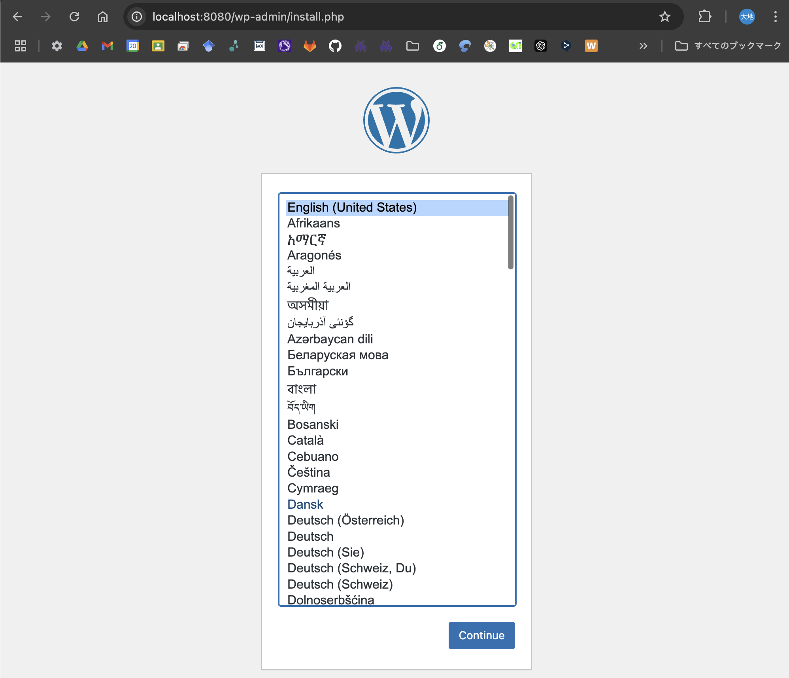

#### WordPressイメージの主な環境変数
| 環境変数 | 意味 |
| --- | --- |
| `WORDPRESS_DB_HOST` | 接続先のコンテナ名．`compose.yaml`で定義した名前を設定する． |
| `WORDPRESS_DB_NAME` | 接続先データベースのデータベース名 |
| `WORDPRESS_DB_USER` | 接続先データベースのユーザー名 |
| `WORDPRESS_DB_PASSWORD` | 接続先データベースのパスワード |

</br>

## コンテナ内のデータの永続化
ここまでの説明では，コンテナ内のデータを暗黙的に永続化してきたが，本来はコンテナを削除するとコンテナ内のデータも削除される．
「[2. Docker Composeファイルを作成する](#2-docker-composeファイルを作成する)」での`compose.yaml`では[バインドマウント](#方法1-バインドマウント)，
「[Docker Composeで複数コンテナを一度に作成](#docker-composeで複数コンテナを一度に作成)」の`compose.yaml`では，[ボリューム](#方法2-ボリューム)を使って永続化している．

### 方法1: バインドマウント
**バインドマウンド**は，ホストOSのフォルダーやファイルをマウントする仕組み．
データを変更する際は，ホストOSのファイルを直接変更することで，コンテナ内にも自動で反映される．
そのため，**変更頻度の高いデータ**に向いている．

- バインドマウンドによる永続化
    ```yaml
    services:
      コンテナ名:
        image: 使用するイメージ名
        volumes:
          - ホストOSのフォルダー:コンテナ内のパス
    ```

### 方法2: ボリューム
**ボリューム**は，Dockerが管理する記憶領域にデータを永続化する仕組み．
データを変更する際は，データを直接操作するのではなく，コンテナを通して行う．
そのため，データベースのデータなど，**直接変更することのないデータ**に向いている．

- ボリュームによる永続化
    ```yaml
    services:
      コンテナ名:
        image: 使用するイメージ名
        volumes:
          - 以下の`volumes`に定義したボリューム名:コンテナ内のパス
    volumes:
      ボリューム名
    ```

</br>

# Visual Studio Code + Dockerで開発環境を構築
まず[Visual Studio Code](https://code.visualstudio.com/)をインストール．
Visual Studio Code（以下VSCode）は，Microsoftが開発したコードエディタ．
軽い．拡張機能がGUIで簡単にインストール・アンインストールできるのでその管理も楽．
このセクションでは，VSCodeとDockerを使って開発環境を構築する．

## 拡張機能のインストール
まず，VSCodeの拡張機能（Dev Containers）をインストールする．
画面左端のExtensions（日本語化した場合は拡張機能）の検索欄で拡張機能を検索&インストールできる．

- Dev Containers

  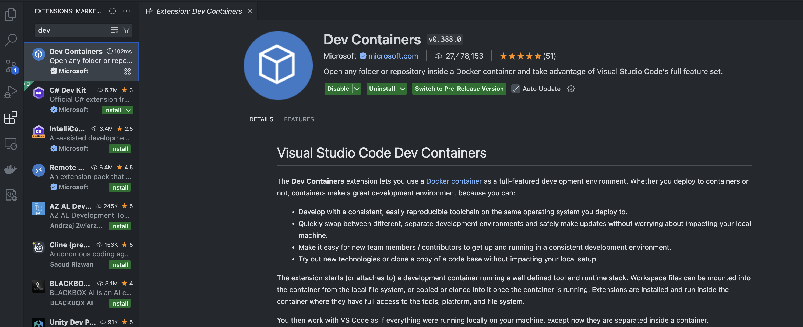

## VSCodeでコンテナに接続する
VSCodeとコンテナを接続するにはいくつか方法があるが，ここでは，`compose.yaml`から作成する方法を紹介する．

</br>

---
#### Step 1. 
はじめにVSCodeのコマンドパレットを開く．Windowsでは`Ctrl+Shift+p`，Macでは`cmd+shift+p`．

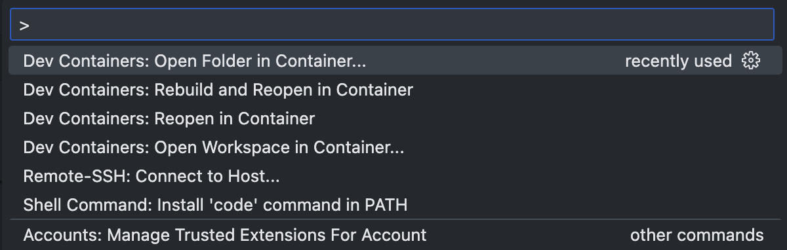

---
#### Step 2. 
コマンドパレット上で`dev containers open`と入力し，「`Dev Containers :Open Folder in Container `」を選択．

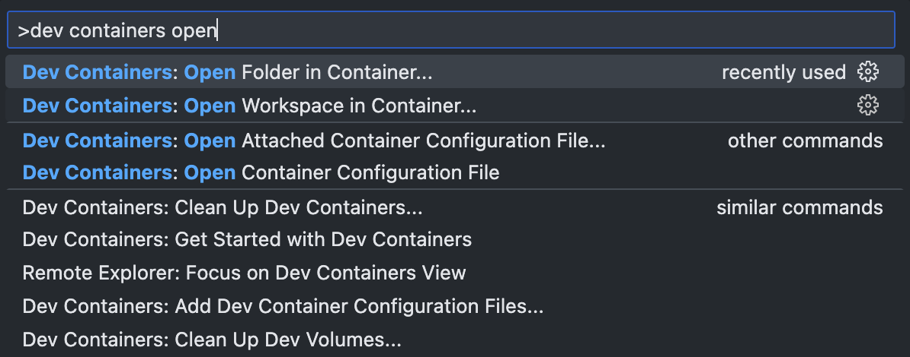

---
#### Step 3. 
`compose.yaml`があるディレクトリを選択しOpen．ここでは「[DockerfileとDocker Composeで自作コンテナを作成する](#dockerfileとdocker-composeで自作コンテナを作成する)」で使った`jupyter`ディレクトリを使用する．

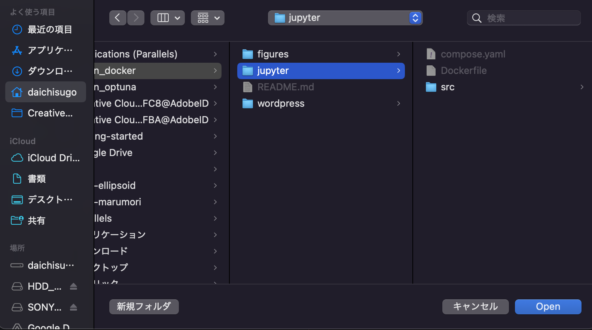

---
#### Step 4. 
Add Dev Container Configuation Filesで，「**Add configuration to workspace**」を選択

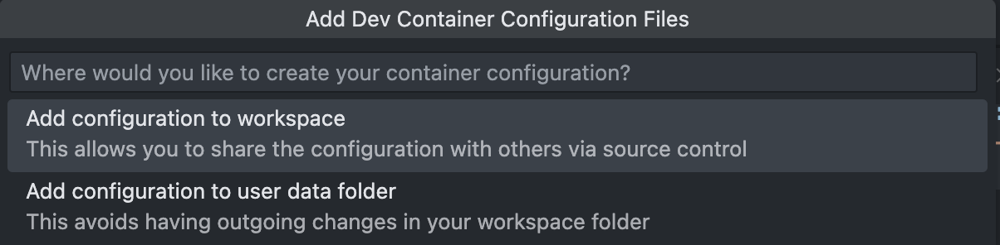

---
#### Step 5. 
次に，『**From compose.yaml**』を選択．

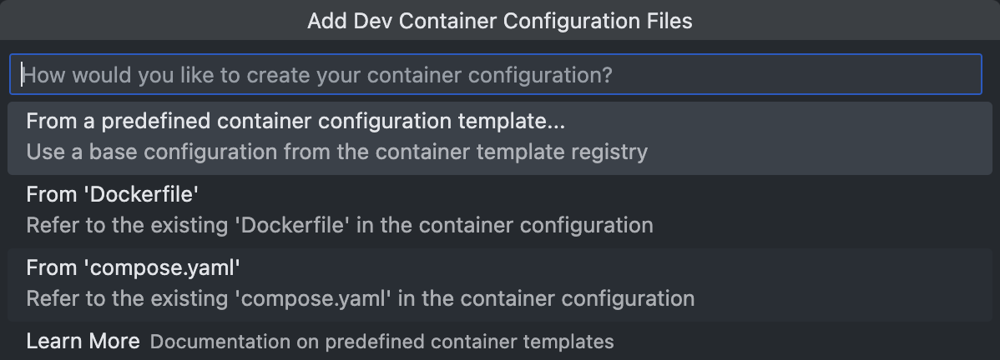

---
#### Step 6. 
Select Features，Optional Files/Directoriesは何も選択せずOKを押す．

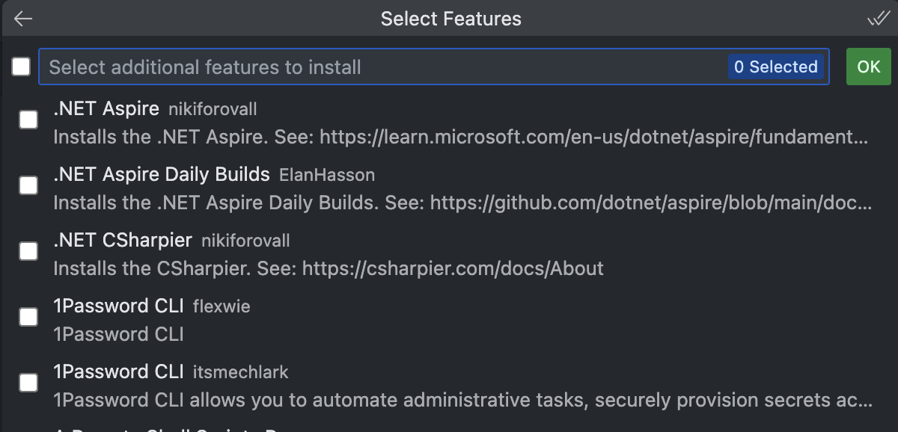
  
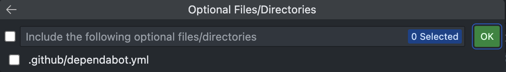

---
#### Step 7. 

初回はイメージのプルとコンテナの作成が行われるため，少し時間がかかる．
ビルドが終わると，選択したフォルダが表示され，ファイルを選択できるようになる．
加えて，`.devcontainer`というフォルダが作成される．
これは，コンテナ接続のために必要なファイルが配置されるためのフォルダのため消さないように．

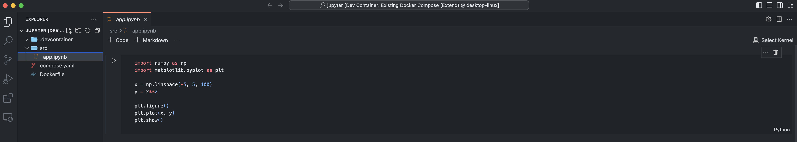

---
#### Step 8.
`app.ipynb`のセルを`Shift+Enter`または「︎▶」で実行する．
（初回はここで，PythonやJupyter関連の拡張機能のインストールを勧められるので，すべてインストール．）

#### Step 9.

「**Python Environments...**」，「**Python 3.10.15**」（Global Envと表示されているもの） の順に選択．

- Python Envirionmentsを選択

    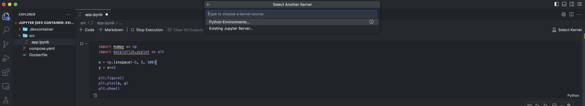

- Python 3.10.15を選択

    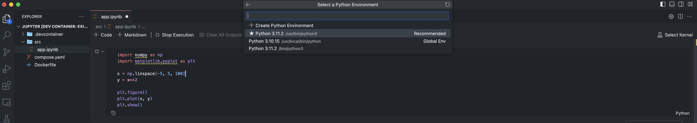

---
#### Step 10.
カーネルを選択すると，セルの実行が開始し，下にグラフが表示される．

- 出力結果

    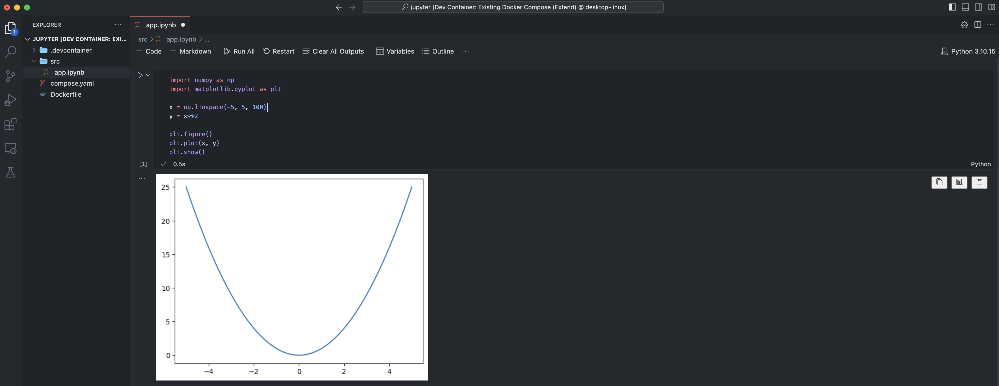

---
#### おしまい